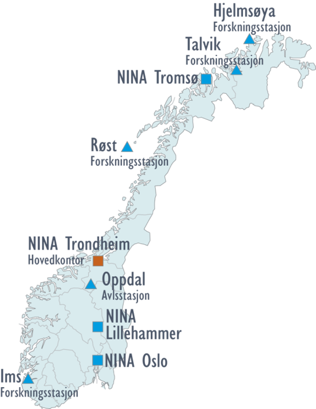

```{r setup, echo=FALSE}
# A lot of options can be tweaked through the knitr::opts_chunk, like below.
# The use of 'tikz' is optional, and is used here to specify the font used
# in figures, and to get figure text rendered nicely. 'Tikz' is a little bit slower
# to render though and therefore we use 'cache=T'. Set this to false to force the 
# figures to render.
# pdf is also a good choice instead of 'tikz', but won't create as nice figure texts.

# Other options are set in the YAML-section at the beginning of the file. See the rmarkdown
# and knitr manuals to make sense of these. The date in the YAML-section can be replaced
# with a static value.

# Some trial and error is needed to get the figure and column sizes right.


knitr::opts_chunk$set(comment=NA, collapse=T, cache=T, autodep=T,
               dev="tikz", fig.width = 4.5,
               fig.height = 4,
               out.width = '0.8\\linewidth',
               size ='footnotesize',
               dev.args=list(pointsize=12),
               message=F, warning=F,
               fig.align = 'center')
options(tikzDefaultEngine="xetex")
options(tikzXelatexPackages=c(
    "\\usepackage{tikz}\n",
    "\\usepackage[active,tightpage,xetex]{preview}\n",
    "\\usepackage{fontspec,xunicode}\n",
    "\\setmainfont{Verdana}\n",
    "\\PreviewEnvironment{pgfpicture}\n",
    "\\setlength\\PreviewBorder{0pt}\n"))

```

## Beamer-malle for NINA
```{r echo=F, results = 'asis'}
cat("\\scriptsize")
```

**Fra originalmallen:**

This is an R Markdown presentation. Markdown is a simple formatting syntax for authoring HTML, PDF, and MS Word documents. For more details on using R Markdown see <http://rmarkdown.rstudio.com>.

**NINA-anpassning:**

Denne malle ligner Powerpoint-mallen ganske bra, men fortsatt er det noen ting som ikke overenstemmer helt. Funksjonaliteten i beamer er også litt mer begrenset. 

Rent tekniskt starter teksten som en blanding av "Rmarkdown" og "R", og kjørs siden gjennom "Knitr" og blir til "markdown"-format. Dette bearbeides siden i "Pandoc" og konverteres til en PDF-fil med hjelp av "XeteX". Tanken er at det skal bli enklere enn å bruke ren \LaTeX, men de mange stegen gjør det også mer utfordrende og endre på standardoppsettet.


## Norsk institutt for naturforskning

\columnsbegin
\column{.6\textwidth}

- Uavhengig stiftelse som forsker på natur og samspillet natur-samfunn
- Fristilt fra miljøforvaltningen (DN) i 1998
- 222 medarbeidere (2014)
- 332 Mkr i omsetning (2014)


\column{.4\textwidth}



\columnsend


## Størrelse på figurer

Ibland kan det vare nødvendig å sette størrelsen på figurer slik

```{r,  out.width = '80pt', dev='png', echo=F}


```


## Side with kulepunkter
- Før det første
- Før det andre
    - Å ene siden
    - Å andre siden
        - For det tredje

## En lite lengre titel for å se hvordan den fyller to rader

```{r cars, echo = F }
suppressPackageStartupMessages(require(NinaR))
barplot(runif(5), col=ninaPalette(), las = 1)
```

## Tabeller lages slik
```{r, echo=F, size=4}
suppressPackageStartupMessages(require(xtable))
```

```{r pressure, results='asis'}
print(xtable(head(cars)), comment=F)
```

## Kolonner lages slik

\columnsbegin
\column{.45\textwidth}


```{r, eval=F, tidy=F}
library(ggplot2)
# Let's use the 
#diamonds dataset
data(diamonds)
ggplot(data=diamonds, 
   aes(x=price, 
     group=cut, 
     fill=cut)) + 
geom_density(adjust=1.5, 
     alpha=0.2)
```

\column{.6\textwidth}

```{r, echo=F}

# ggplot2 library
library(ggplot2)
# Let's use the diamonds dataset
data(diamonds)
#head(diamonds)

# plot 2: Density plot with transparency (using the alpha argument):
ggplot(data=diamonds,aes(x=price, group=cut, fill=cut)) + 
    geom_density(adjust=1.5 , alpha=0.2)
```

\columnsend

## Stor kod

Størrelsen på fonten til kod er satt till "scriptsize", men kan endres i hver side slik:
```{r, results='asis', echo=T}
cat("\\fvset{fontsize=\\tiny}")
```
Mulige størrelser er:
\columnsbegin
\column{.3\textwidth}

* \\tiny
* \\scriptsize	
* \\footnotesize	
* \\small	

\column{.3\textwidth}

* \\normalsize
* \\large	
* \\Large	

\column{.3\textwidth}

* \\LARGE	
* \\huge	
* \\Huge

\columnsend
